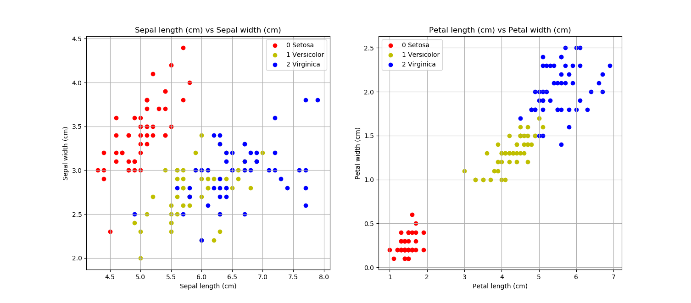
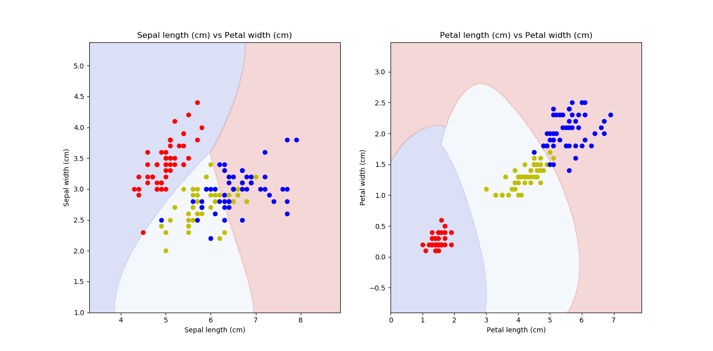

# Sklearn: Support Vector Machine

### **Introduction**

In statistics, __Support Vector Machine (SVM)__ is a discriminative classifier formally defined by a separating _hyperplane_. In other words, given labeled training data (supervised learning), the algorithm outputs an optimal hyperplane which categorizes new examples.

#

### **Plot Sklearn Data Iris**

Clone/download this repo, open & run python script: __*0_plotIris.py*__. It will create a scatter plot of dataset with its category: _setosa, versicolor_ & _virginica_. Make sure you have installed __*pandas*__, __*numpy*__, __*matplotlib*__ & __*sklearn*__ packages!

```python

import pandas as pd
import numpy as np
import matplotlib.pyplot as plt

from sklearn.datasets import load_iris
iris = load_iris()
print(dir(iris))

# ==========================
# create dataframe

dfIris = pd.DataFrame(
    iris['data'],
    columns = iris['feature_names']
)
dfIris['target'] = iris['target']
dfIris['spesies'] = dfIris['target'].apply(
    lambda index: iris['target_names'][index]
)
# print(dfIris.tail())

# =============================
# separate df by its species

dfSetosa = dfIris[dfIris['target'] == 0]
# print(dfSetosa)
dfVersicolor = dfIris[dfIris['target'] == 1]
# print(dfVersicolor)
dfVirginica = dfIris[dfIris['target'] == 2]
print(dfVirginica)

# =============================
# scatter plot

fig = plt.figure('Iris Data', figsize=(14,7))

# plot sepal length vs sepal width
plt.subplot(121)
plt.scatter(
    dfSetosa['sepal length (cm)'],
    dfSetosa['sepal width (cm)'],
    color = 'r',
    marker = 'o'
)
plt.scatter(
    dfVersicolor['sepal length (cm)'],
    dfVersicolor['sepal width (cm)'],
    color = 'y',
    marker = 'o'
)
plt.scatter(
    dfVirginica['sepal length (cm)'],
    dfVirginica['sepal width (cm)'],
    color = 'b',
    marker = 'o'
)
plt.title('Sepal length (cm) vs Sepal width (cm)')
plt.xlabel('Sepal length (cm)')
plt.ylabel('Sepal width (cm)')
plt.legend(['0 Setosa', '1 Versicolor', '2 Virginica'])
plt.grid(True)

# plot petal length vs petal width
plt.subplot(122)
plt.scatter(
    dfSetosa['petal length (cm)'],
    dfSetosa['petal width (cm)'],
    color = 'r',
    marker = 'o'
)
plt.scatter(
    dfVersicolor['petal length (cm)'],
    dfVersicolor['petal width (cm)'],
    color = 'y',
    marker = 'o'
)
plt.scatter(
    dfVirginica['petal length (cm)'],
    dfVirginica['petal width (cm)'],
    color = 'b',
    marker = 'o'
)
plt.title('Petal length (cm) vs Petal width (cm)')
plt.xlabel('Petal length (cm)')
plt.ylabel('Petal width (cm)')
plt.legend(['0 Setosa', '1 Versicolor', '2 Virginica'])
plt.grid(True)

plt.show()

```



#

### **Plot Sklearn Data Iris with SVM Algorithm**

Clone/download this repo, open & run python script: __*4_svm_plotAll.py*__. It will create a scatter plot of dataset with its classification.

```python

import pandas as pd
import numpy as np
import matplotlib.pyplot as plt

from sklearn.datasets import load_iris
iris = load_iris()
print(dir(iris))

# ==========================
# create dataframe

dfIris = pd.DataFrame(
    iris['data'],
    columns = iris['feature_names']
)
dfIris['target'] = iris['target']
dfIris['spesies'] = dfIris['target'].apply(
    lambda index: iris['target_names'][index]
)
print(dfIris.head())
print(dfIris.iloc[54:56])
print(dfIris.tail())

# =============================
# separate df by its species

dfSetosa = dfIris[dfIris['target'] == 0]
# print(dfSetosa)
dfVersicolor = dfIris[dfIris['target'] == 1]
# print(dfVersicolor)
dfVirginica = dfIris[dfIris['target'] == 2]
print(dfVirginica)

# ==========================
# split datasets: train 90% & test 10%

from sklearn.model_selection import train_test_split
xtra, xtes, ytra, ytes = train_test_split(
    dfIris[[
        'sepal length (cm)',
        'sepal width (cm)',
        'petal length (cm)',
        'petal width (cm)'
    ]],
    dfIris['spesies'],
    test_size = .1
)

# print(len(xtra))
# print(len(xtes))

# ==========================
# support vector machine
# support vector classifier

from sklearn.svm import SVC
model1 = SVC(gamma = 'auto')
model2 = SVC(gamma = 'auto')

# =============================
# plot svm

def bikin_meshgrid(x, y):
    x_min = x.min() - 1
    x_max = x.max() + 1
    y_min = y.min() - 1
    y_max = y.max() + 1
    xx, yy = np.meshgrid(
        np.arange(x_min, x_max, .02),
        np.arange(y_min, y_max, .02)
    )
    return xx, yy

sepal = iris['data'][:, :2]
x0, x1 = sepal[:, 0], sepal[:, 1]
petal = iris['data'][:, 2:]
x2, x3 = petal[:, 0], petal[:, 1]
ww, xx = bikin_meshgrid(x0, x1)
yy, zz = bikin_meshgrid(x2, x3)

model1.fit(sepal, iris['target'])
model2.fit(petal, iris['target'])

# ==========================
# plot

def plotSVM(ax, model, xx, yy, **params):
    z = model.predict(np.c_[xx.ravel(), yy.ravel()])
    z = z.reshape(xx.shape)
    hasil = ax.contourf(xx, yy, z, **params)
    return hasil

fig = plt.figure('SVM', figsize=(14,7))

ax = plt.subplot(121)
plotSVM(ax, model1, 
    ww, xx, 
    cmap = 'coolwarm', 
    alpha = .2
)
plt.scatter(
    dfSetosa['sepal length (cm)'],
    dfSetosa['sepal width (cm)'],
    color = 'r',
    marker = 'o'
)
plt.scatter(
    dfVersicolor['sepal length (cm)'],
    dfVersicolor['sepal width (cm)'],
    color = 'y',
    marker = 'o'
)
plt.scatter(
    dfVirginica['sepal length (cm)'],
    dfVirginica['sepal width (cm)'],
    color = 'b',
    marker = 'o'
)
ax.set_xlabel('Sepal length (cm)')
ax.set_ylabel('Sepal width (cm)')
ax.set_title('Sepal length (cm) vs Petal width (cm)')

ax = plt.subplot(122)
plotSVM(ax, model2, 
    yy, zz, 
    cmap = 'coolwarm', 
    alpha = .2
)
plt.scatter(
    dfSetosa['petal length (cm)'],
    dfSetosa['petal width (cm)'],
    color = 'r',
    marker = 'o'
)
plt.scatter(
    dfVersicolor['petal length (cm)'],
    dfVersicolor['petal width (cm)'],
    color = 'y',
    marker = 'o'
)
plt.scatter(
    dfVirginica['petal length (cm)'],
    dfVirginica['petal width (cm)'],
    color = 'b',
    marker = 'o'
)
ax.set_xlabel('Petal length (cm)')
ax.set_ylabel('Petal width (cm)')
ax.set_title('Petal length (cm) vs Petal width (cm)')

plt.show()

```



#

#### Lintang Wisesa :love_letter: _lintangwisesa@ymail.com_

[Facebook](https://www.facebook.com/lintangbagus) | 
[Twitter](https://twitter.com/Lintang_Wisesa) |
[Google+](https://plus.google.com/u/0/+LintangWisesa1) |
[Youtube](https://www.youtube.com/user/lintangbagus) | 
:octocat: [GitHub](https://github.com/LintangWisesa) |
[Hackster](https://www.hackster.io/lintangwisesa)